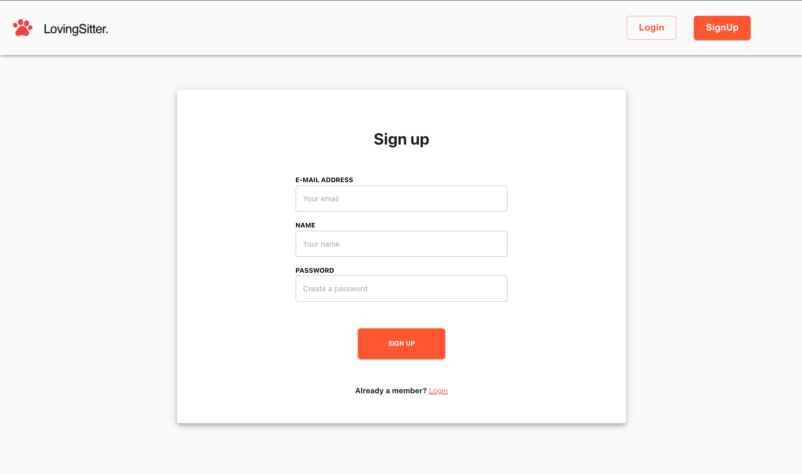
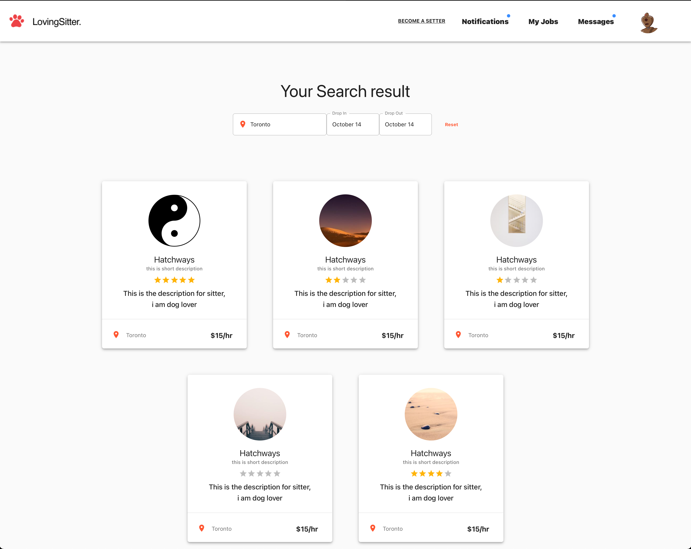
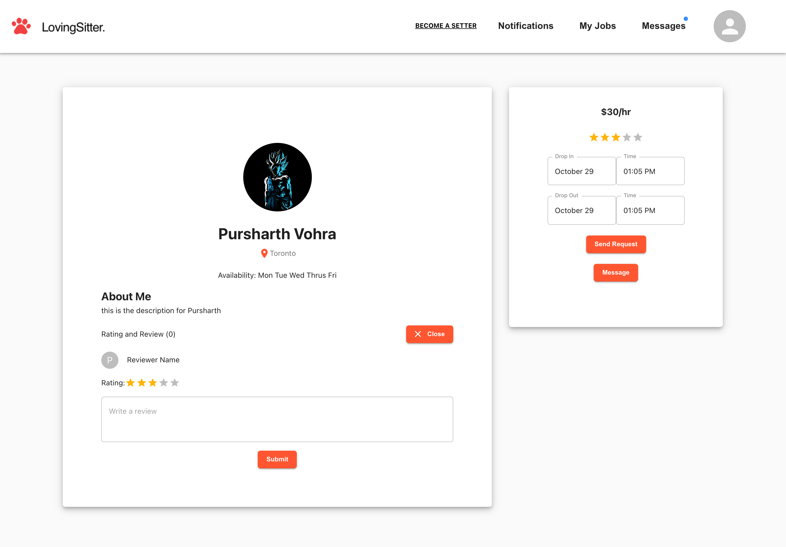
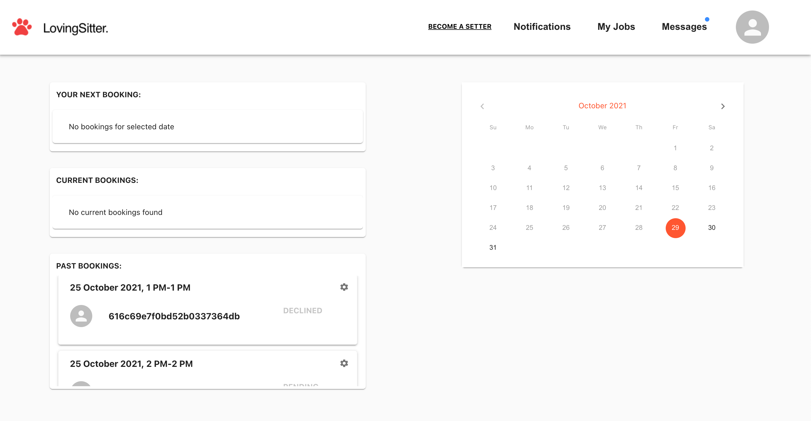
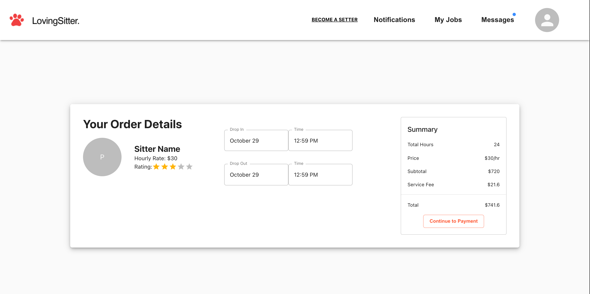
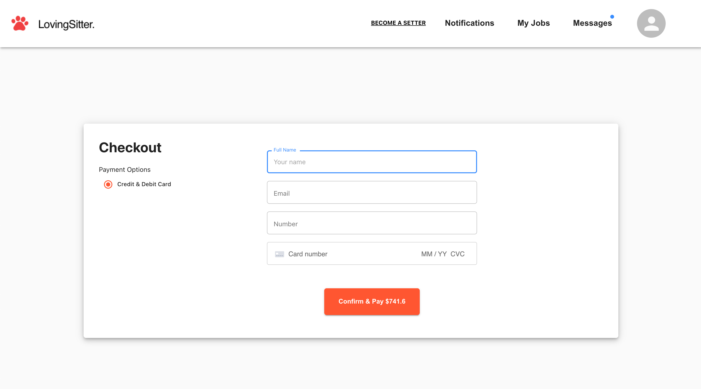

## Pet Sitter Service

Now a days, pet owner have to struggle a lot to find some one to sit their pet who is trust worthy and reliable. In order to solve this problem our team have create a wonder full solution called Loving Sitter. By using our application, pet owners can easily search for pet sitter in their city and enjoy their services.

Our team have choosen to work on MERN ( Mongo, Express, React, Node ) stack along with Typescript on frontend.

**Tech Stack:** MongoDB, Express.js, React.js, Node.js, Typescript

**Contributors:**

- [Pursharth](https://github.com/parasVohra) Contributions [PR](https://github.com/hatchways/team-chicken-noodle/pulls?q=is%3Apr+author%3AparasVohra+is%3Aclosed)
- [Artur](https://github.com/ar2rworld) Contributions [PR](https://github.com/hatchways/team-chicken-noodle/pulls?q=is%3Apr+is%3Aclosed+author%3Aar2rworld)
- [Surafel](https://github.com/lesurafel) Contributions [PR](https://github.com/hatchways/team-chicken-noodle/pulls?q=is%3Apr+is%3Aclosed+author%3Alesurafel)
- [Ethan]() (TEAM LEAD)

---

### Getting Started

1. Clone or download repository

---

## Server

1. Go into the server directory `cd server`
2. Run `npm install` to install packages
3. Create your environment variable (.env) file and add
   - `JWT_SECRET="your jwt secret"`
   - `MONGO_URI="copy your mongo uri here"`
   - `AWS_BUCKET_NAME="aws bucket name"`
   - `AWS_BUCKET_REGION="region name"`
   - `AWS_ACCESS_KEY="aws access key"`
   - `AWS_SECRET_KEY="aws secret key"`
   - `STRIPE_PUBLISHABLE_KEY="publishable key for stripe"`
   - `STRIPE_SECRET_KEY="secret key for stripe"`
4. Run `npm run dev` to start the server

---

## Client

1. Go into the client directory `cd client`
2. Run `npm install` to install packages
3. Create `.env` file in root directory of client project and add `REACT_APP_STRIPE_PUBLIC_KEY="Publishable key obtained from Stripe"`
4. Run `npm start` to start the client side

---

### Demo

1. Registration. Users will be able to create a new account using their email and password.

2. Dashboard. Here is a description about what a user can expect to see.

3. Sitters Listing Page. Here you can search for sitters in your city.

4. Profile details page.

5. Manage Booking page.

6. Summary Page.

7. Checkout Page.

